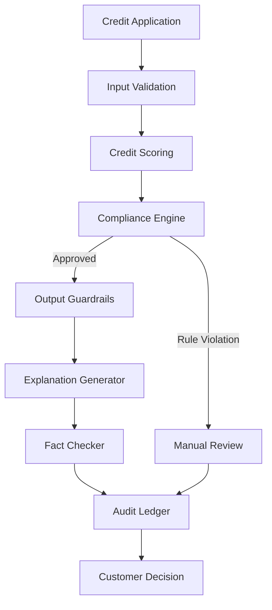

# CREDERE Architecture

> **Neuro-Symbolic Compliance & Hallucination-Free Explanations for Credit Scoring**

---

# Overview

CREDERE is a modular credit-scoring architecture designed for regulated financial environments where predictive performance alone is insufficient.

Unlike conventional ML pipelines, CREDERE separates **statistical prediction** from **regulatory decision-making**.

The predictive model estimates risk.

Deterministic components enforce legal compliance, generate verifiable explanations, and guarantee auditability.

This design follows a **Neuro-Symbolic AI** approach, combining machine learning with explicit rule-based reasoning.

---

# Design Philosophy

The architecture is built around six principles.

## 1. Prediction is not a legal decision

Machine learning estimates credit risk.

It never produces legally binding outcomes.

---

## 2. Law overrides statistics

Whenever a statistical prediction conflicts with legal or institutional policy, deterministic rules take precedence.

Compliance always has veto authority.

---

## 3. Explainability by design

Customer explanations are generated from structured decision data rather than free-form language generation.

Every explanation is traceable.

---

## 4. Human oversight remains available

Borderline or exceptional cases are escalated to human analysts.

Automation supports decision-making but never eliminates accountability.

---

## 5. Every decision is auditable

Every stage of the decision pipeline is recorded.

The complete reasoning process can be reconstructed afterwards.

---

## 6. Fail closed

Whenever uncertainty exists, the system blocks or escalates instead of making assumptions.

---

# Repository Scope

This repository exposes two production-ready modules extracted from the broader CREDERE platform.

- Compliance Engine
- Explanation Engine

The remaining platform components (model training, orchestration, optimisation, memory and monitoring) are outside the scope of this public release.

The demonstration script simulates the predictive model using static decision objects.

---

# High-Level Architecture

```text
                 Credit Application
                        │
                        ▼
               Input Validation
                        │
                        ▼
             Statistical Credit Model
             (score + reason codes)
                        │
                        ▼
               Compliance Engine
                        │
        ┌───────────────┴───────────────┐
        │                               │
        ▼                               ▼
 Approved by Rules                Rule Violation
        │                               │
        ▼                               ▼
 Output Guardrails              Manual Review
        │
        ▼
 Explanation Generator
        │
        ▼
     Fact Checker
        │
        ▼
 Human Oversight
        │
        ▼
 Immutable Audit Log
        │
        ▼
  Final Customer Decision
```

---

# System Components

## Input Validation

The first layer validates incoming applications before any statistical processing.

Responsibilities include:

- Required field validation
- Data type verification
- Missing value detection
- Range validation
- Invalid application rejection

Invalid requests terminate immediately.

---

## Credit Scoring

The statistical model estimates applicant creditworthiness.

Its output consists of:

- Credit score
- Approval probability
- Reason codes

The model never issues customer-facing decisions.

---

## Compliance Engine

The Compliance Engine evaluates whether the statistical recommendation complies with legal and institutional constraints.

Typical rules include:

- Maximum Debt-Service-to-Income ratio
- Mandatory documentation
- Protected attribute exclusion
- Internal banking policies

Possible outcomes:

- Approved
- Rejected
- Manual review

When any mandatory rule is violated, the original prediction is overridden.

This deterministic veto mechanism is the architectural core of the repository.

---

## Output Guardrails

After compliance validation, a second protection layer verifies that the decision is internally consistent.

Examples include:

- Sanction list verification
- Mandatory fields
- Output consistency
- Decision completeness

Only validated decisions continue.

---

## Explanation Engine

Customer explanations are generated deterministically.

The engine uses structured decision data rather than generative reasoning.

Inputs:

- Final decision
- Credit score
- Reason codes
- Decision factors

Outputs:

- Human-readable explanation
- Supporting evidence

---

## Fact Checker

Every explanation is automatically verified.

Each numerical statement is compared against the original decision object.

If any mismatch exists:

- explanation rejected
- deterministic version restored

This guarantees factual consistency.

---

## Human Review

Applications requiring judgement are escalated.

Typical scenarios include:

- Compliance conflicts
- Borderline scores
- Exceptional cases

Human reviewers receive:

- Statistical prediction
- Compliance report
- Generated explanation
- Supporting evidence

---

## Audit Ledger

Every completed decision produces an immutable audit record.

Stored information includes:

- Original prediction
- Compliance verdict
- Final outcome
- Explanation
- Rule evaluations
- Timestamp
- System version

This enables complete traceability.

---

# Decision Flow



---

# Compliance Pipeline

```mermaid
flowchart LR

Prediction

-->

Compliance Rules

-->

DSTI Check

-->

Protected Attribute Check

-->

Documentation Check

-->

Compliance Verdict
```

---

# Explanation Pipeline

```mermaid
flowchart LR

Decision

-->

Reason Codes

-->

Template Engine

-->

Explanation

-->

Fact Checker

-->

Verified Explanation
```

---

# Component Responsibilities

| Component | Responsibility |
|------------|----------------|
| Credit Model | Estimate creditworthiness |
| Compliance Engine | Apply deterministic legal rules |
| Guardrails | Validate integrity |
| Explanation Engine | Produce deterministic explanations |
| Fact Checker | Verify factual consistency |
| Human Review | Resolve exceptional cases |
| Audit Ledger | Preserve traceability |

---

# System States

Applications progress through the following states.

```text
Received

↓

Validated

↓

Scored

↓

Compliance Review

↓

Output Validation

↓

Explanation Generated

↓

Fact Verified

↓

Audited

↓

Completed
```

Terminal outcomes:

- Approved
- Rejected
- Manual Review

---

# Security Principles

The architecture adopts a defence-in-depth strategy.

Core principles include:

- Fail closed
- Separation of concerns
- Least privilege
- Human oversight
- Deterministic compliance
- Immutable auditing
- Explainability
- Traceability

---

# Failure Modes

| Failure | System Response |
|----------|----------------|
| Invalid application | Reject request |
| Compliance violation | Veto prediction |
| Missing data | Stop processing |
| Explanation mismatch | Reject explanation |
| Rule conflict | Manual review |
| Internal error | Fail closed |

---

# Neuro-Symbolic Architecture

CREDERE combines two complementary paradigms.

## Statistical Layer

Responsible for:

- Risk prediction
- Pattern recognition
- Probability estimation

Technologies may include logistic regression, gradient boosting or other machine learning models.

---

## Symbolic Layer

Responsible for:

- Legal compliance
- Institutional policy
- Deterministic reasoning
- Rule enforcement

Unlike the statistical layer, symbolic decisions are fully reproducible.

---

# Human-in-the-Loop

Automation does not replace expert judgement.

Instead, CREDERE allows qualified analysts to intervene whenever:

- confidence is low
- regulations require human supervision
- deterministic rules block automation
- exceptional situations occur

Every manual intervention is recorded in the audit trail.

---

# Architectural Principles

The architecture follows the Single Responsibility Principle.

Each module performs exactly one task.

```
Prediction

↓

Compliance

↓

Validation

↓

Explanation

↓

Verification

↓

Audit
```

This separation improves:

- Maintainability
- Testability
- Explainability
- Regulatory compliance

---

# Future Evolution

The complete CREDERE platform extends beyond this repository.

Future architectural layers include:

- Knowledge Graphs
- Retrieval-Augmented Generation
- Long-term Memory
- Mixture of Experts
- World Models
- Dynamic Optimisation
- Continuous Monitoring
- Drift Detection
- Multi-Agent Orchestration

These capabilities belong to the complete research platform and are intentionally excluded from this open-source release.

---

# Conclusion

CREDERE demonstrates an alternative architectural approach to regulated AI.

Instead of relying exclusively on predictive models, the system separates statistical inference from legally binding decisions through deterministic compliance, factual explanation generation and complete auditability.

This architecture enables transparent, explainable and defensible automated credit decisions while preserving human oversight and regulatory compliance.